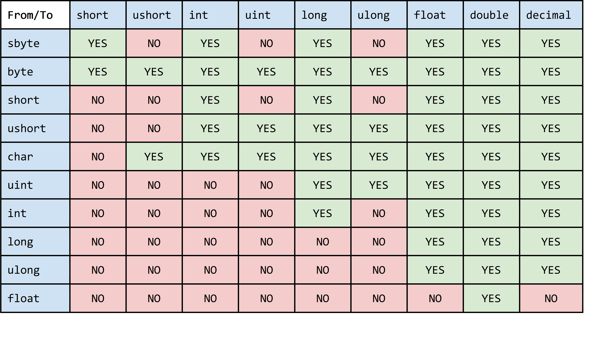

# ใบงานที่ 6 เมธอด ตัวดำเนินการ และนิพจน์ 

(Methods, Operators and Expression)

## เมธอด (Method)

เมธอดเป็นบล็อกของ source code ที่ประกอบด้วยคำสั่งต่างๆ โปรแกรมที่เราเขียนขึ้น อาจจะเรียกใช้เมธอดซึ่งอาจจะมีการส่ง arguments ไปยังเมธอดนั้นๆ ด้วย ในโปรแกรมภาษา C# นั้น ทุกคำสั่งจะต้องอยู่ภายใต้เมธอด โดยมีเมธอดชื่อ Main() เป็นตัวอย่าง เราไม่สามารถเขียนคำสั่งใดๆ ไว้ นอกเมธอดได้ เมธอด Main() จะเป็น เมธอดแรกในโปรแกรมที่ถูกเรียกขึ้นมาทำงาน คนที่เรียกใช้งาน Main()  คือ Common Language Runtime (CLR)  
ในการเขียนโปรแกรมภาษา C# เราจะพบว่ามี method อยู่สองจำพวกใหญ่ๆ คือ เมธอดที่ถูกเขียนไว้แล้ว โดยผู้พัฒนา Framework กับเมธอดที่เราต้องพัฒนาขึ้นมาเองเพื่อแก้ปัญหาเฉพาะอย่าง โดยเมธอดที่จัดเตรียมไว้แล้วนั้น จะถูกเก็บไรวมกันในมีที่อยู่เฉพาะ แบ่งเป็นพวกๆ เช่น พวกเมธอดที่เกี่ยวกับการแสดงข้อความ พวกเมธอดที่เกี่ยวกับการแสดงกราฟฟิกส์ พวกเมธอดที่เกี่ยวกับการอ่านเขียนไฟล์ พวกเมธอดที่เกี่ยวกับการใช้งานเน็ตเวิร์คต่างๆ เป็นตน  เราต้องใช้เวลาในการศึกษาและทำความเข้าใจเมธอดเหล่านั้นให้ถี่ถ้วน เพื่อที่จะนำมาใช้งานได้อย่างมีประสิทธิภาพและลดโอกาสที่จะเกิด bug ขึ้นในโปรแกรม แต่การใช้เมธอดเหล่านี้ก็มีข้อดีคือประหยัดเวลา เนื่องจากเป็นเมธอดที่ผ่านกระบวนการออกแบบ สร้าง และทดสอบการทำงานมาแล้วโดยผู้ที่มีควาเชี่ยวชาญ

## เมธอดที่จัดเตรียมไว้แล้ว (Predefined methods)

เมธอดที่จัดเตรียมไว้แล้ว มักจะอยู่ใน Library ที่เราดึงเข้ามาผ่านคำสั่ง using เช่นในใบงานที่ผ่านมา เราสามารถใช้ Console.WriteLine()  ได้นั้นก็เนื่องจาก C# ได้เตรียม method ต่างๆ ไว้แล้ว เราสามารถดึงมาใช้ในโปรแกรมโดยการใช้คำสั่ง using System;  
ถ้าต้องการศึกษาว่ามี method อะไรบ้างให้เรียกใช้ นอกจากจะศึกษาจาก API ในเอกสารคู่มือของผู้ผลิตแล้ว เรายังสามารถเรียกดูผ่าน IDE ได้โดยมีลำดับขั้นตอนดังตัวอย่างในรูปที่ 1 หรือกด F12 เมื่อ caret อยู่ที่ชื่อเมธอด


__รูปที่ 1__ การเรียกเมนู Go To Definition เพื่อตามไปดูเมธอด


__รูปที่ 2__ ตัวอย่างเมธอด WriteLine ที่อยู่ในคลาส Console

ถ้าเราเลื่อนไปด้านบนหรือด้านล่าง จะพบว่ามีฟังก์ชันอีกจำนวนไม่น้อย ที่อยู่ในคลาส Console และมีคลาสอีกจำนวนไม่น้อยใน namespace ที่ชื่อ System และมี namespace อีกจำนวนมาก ใน .NET Framework ซึ่งสามารถสรุปได้ว่า ใน .NET Framework มีเมธอดสำเร็จรูปให้เรียกใช้เพียงพอแก่ความต้องการขั้นต้น
 
 

__รูปที่ 3__ รายละเอียดสำหรับเมธอด WriteLine(object value) ซึ่งอยู่ในคลาส Console

ในการพัฒนาซอฟต์แวร์นั้น ในบางครั้งเราต้องเขียนโปรแกรมเพื่อตอบสนองความต้องการของผู้ใช้ ซึ่งอาจจะต้องประมวลผลตามรูปแบบเฉพาะ และไม่มีเมธอดสำเร็จรูปให้ใช้งาน ดังนั้นเราจะต้องสร้างเมธอดเอง ซึ่งก็ต้องสร้างให้ตรงตามข้อกำหนดของภาษา หรือเพื่อให้มีความเข้ากันได้กับเมธอดที่เขียนโดยโปรแกรมเมอร์ทุก ๆ คน

## ตัวอย่างการเรียกใช้งานเมธอดที่จัดเตรียมไว้แล้ว

เมธอดที่มีการจัดเตรียมไว้แล้ว จะมีประโยชน์ในการใช้งานเป็นอย่างมาก เนื่องจากในการแก้ปัญหาบางอย่าง จะต้องมีส่วนประกอบต่างๆ จำนวนมาก เช่นจากตัวอย่างต่อไปนี้เป็นการอ่านข้อมูลจาก URL แล้วเก็บลงในแฟ้มข้อมูล ซึ่งถ้าหากต้องเขียนเมธอดเหล่านี้เองทั้งหมด ก็จะต้องใช้เวลาศึกษาและพัฒนาค่อนข้างมาก แต่หากเราทราบว่ามีการเขียนโปรแกรมเหล่านั้นไว้แล้วก็สามารถศึกษาในขั้นต้นเพื่อนำเมธอดเหล่านั้นมาใช้ได้ทันที

จากตัวอย่าง บรรทัดที่ 2 และ 3 มีการใช้้คำสั่ง using System.Net และ System.IO เพื่อนำเมธอดเกี่ยวกับอินเตอร์เน็ตและการเขียนอ่านไฟล์มาใช้ ส่วนเกี่ยวกับอินเตอร์เน็ตในตัวอย่างนี้ก็คือคลาส Webclient และเมธอด Webclient.DownloadString() ส่วนที่เกี่ยวกับไฟล์คือคลาส StreamWriter และเมธอด  StreamWriter.Write( );

__คำสั่ง__ ให้นักศึกษาเขียนโปรแกรมดังต่อไปนี้

```csharp
using System;
using System.Net;  // for web client
using System.IO;   // for stream writer

class Program
{
    static void Main()
    {
        // Create web client.
        WebClient client = new WebClient();
        // Download string.
        string value = client.DownloadString("http://www.kmitl.ac.th");
        // Write values.
        Console.WriteLine("--- WebClient result ---");
        Console.WriteLine(value.Length);
        Console.WriteLine(value);
        StreamWriter outtxt = new StreamWriter("webload.html");
        outtext.Write(value);
        outtxt.Dispose();
    }
}
```

เมื่อรันโปรแกรมแล้ว จะได้ไฟล์ที่ชื่อ `webload.html` อยู่ในโฟลเดอร์ `Bin/Debug`

## เคล็ดลับ

วิธีการเข้าไปยังโฟลเดอร์ดังกล่าวอย่างง่าย ทำได้โดยการคลิกขวาที่ชื่อของโปรเจคแล้วเลือก Open Folder in File Explorer ดังตัวอย่างในรูปที่ 4  จากนั้นให้เข้าไปในโฟลเดอร์ Bin และ Debug ตามลำดับ


__รูปที่ 4__ การเปิด File Explorer ไปยัง folder ที่อยู่ของ project

 
## การสร้างและใช้งานเมธอด (User-defined method)

ถึงแม้ว่่าเมธอดที่จัดเตรียมไว้ให้โดยผู้ผลิตจะมีความสามารถมากมายและดูเหมือนจะเพียงพอต่อการใช้งานพื้นฐาน แต่เมื่อเราพัฒนาโปรแกรมไปสักระยะ จะพบว่ามีงานหลายอย่างที่ต้องทำซ้ำ ๆ หรือมีการกระทำซ้ำ ๆ โดยที่มีการเปลี่ยนแปลงค่าเพียงเล็กน้อย เช่นการบวกเลข การวาดรูป หรือการแก้ปัญหาด้วยอัลกอริทึมต่าง ๆ ซึ่งจะประกอบด้วยการกระทำย่อย ๆ ที่มีขั้นตอนซ้ำ ๆ กันซึ่งสามารถใช้ source code ร่วมกันได้ เราจะสามารถนำ source code ที่ซ้ำ ๆ กันนั้น มาเขียนรวมกันเป็นกลุ่ม เพื่อให้สามารถเรียกใช้งานได้โดยง่าย และทำการส่ง  argument ไปให้เมธอดเหล่านั้นเพื่อแทนสิ่งที่ต่างกันเล็ก ๆ น้อย ๆ  ให้พิจารณารูปที่ 5
  


__รูปที่ 5__ ตัวอย่างแนวคิดการรวมงานหรือกระบวนการที่ซ้ำ ๆ ให้เป็นเมธอด

## รูปแบบการเขียนเมธอด (method signature)

ในการเขียนเมธอด เราต้องกำหนดรูปร่างหน้าตาของเมธอด เพื่อที่จะเรียใช้ได้จากส่วนต่าง ๆ ของโปรแกรม รูปร่างหน้าตาของเมธอดเรียกว่า method signature   
  
“เมธอด จะต้องถูกเขียนไว้ภายใต้ class หรือ struct เท่านั้น”

ถึงแม้ว่าตอนนี้เราจะยังไม่เรียนเรื่องคลาสและยังไม่ได้เริ่มเขียนคลาส แต่ถ้าสังเกตุให้ดีจะเห็นว่าเมธอด Main() ที่เราเขียนโปรแกรมทุกอย่างลงไปจะอยู่ภายใต้คลาสโปรเจคที่ IDE สร้างให้ ซึ่งจะมีคลาสเริ่มต้นใช้ชื่อว่า Program

## รูปแบบทั่วไปในการเขียนเมธอด

เมธอด ประกอบด้วย 5 ส่วน ดังตาราง


## กฏในการประกาศเมธอด

* จะต้องเลือกระหว่าง static, virtual และ override จะใช้พร้อมกันไม่ได้
* จะต้องเลือกระหว่าง new  กับ override จะใช้พร้อมกันไม่ได้
* ถ้ามี abstract จะไม่สามารถมี  static, virtual, sealed หรือ extern ได้
* ถ้ามี private จะไม่สามารถมี virtual, override, หรือ  abstract ได้
* ถ้ามี sealed จะต้องมี  override ด้วย
* ถ้ามี partial จะต้องไม่มี new, public, protected, internal, private, virtual, sealed, override, abstract, หรือ extern

## หมายเหตุ

ในการทำ method overloading ไม่ถือว่า ชนิดส่งกลับ (return type) เป็นส่วนหนึ่งของ method signature แต่ในการทำ delegate จะถือว่าเป็น method signature เนื่องจากต้องใช้ในการพิจารณาเลือก delegate (จะศึกษารายละเอียดในภายหลัง) 

## การเขียนเมธอดอย่างง่าย

ให้นักศึกษาทดลองเขียนโปรแกรมง่ายๆ ต่อไปนี้ ซึ่งเป็นตัวอย่างการสร้างเมธอดที่ชื่อ void sayHello()

```csharp
void sayHello()
{
    Console.WriteLine("Hello World.");
}  
```

```csharp
using System;

class Program
{
    static void Main()
    {
        sayHello();
        Console.ReadLine();
    }
    void sayHello()
    {
        Console.WriteLine("Hello World.");
    }
}
```

➢ รันโปรแกรมและบันทึกผล


จากโปรแกรมข้างบน จะพบว่ามีข้อความ error ดังนี้ ในบรรทัดที่ 7 

``
error CS0120: An object reference is required for the non-static field, method, or property 'Program.add(int, int)'
``

เหตุที่เกิด error ดังกล่าว ก็เนื่องจากเมธอดที่ประกาศนั้น เป็น instance method ซึ่งหากจะเรียกใช้งานจะต้องสร้าง object ขึ้นมาและเรียกใช้เมธอดผ่าน object 
วิธีการแก้ไข error ดังกล่าว เราสามารถทำได้โดยการเปลี่ยนเมธอด `sayHello()` ให้เป็น `static` ดังการทดลองต่อไปนี้

```csharp
using System;

class Program
{
    static void Main()
    {
        sayHello();
        Console.ReadLine();
    }

    static void sayHello()
    {
        Console.WriteLine("Hello World.");
    }
}
```

➢ รันโปรแกรมและบันทึกผล

``` text


```

## หมายเหตุ

การแก้ไข error  __CS0120__ ด้วยวิธีการนี้ จะใช้กับการสร้างเมธอดในบางกรณีเท่านั้น หากเป็นการสร้างเมธอดในคลาส ไม่จำเป็นต้องสร้างเป็นแบบ `static` เนื่องจากสามารถทำงานได้ในลักษณะ instance method และถ้าประกาศเป็น `static` จะให้ผลอีกรูปแบบหนึ่ง ซึ่งจะได้เรียนรู้ในเรื่องการใช้งานคลาส

## การสร้างเมธอดที่รับพารามิเตอร์

__🛈 พารามิเตอร์ vs อาร์กิวเมนต์  (Parameters vs arguments)__  
ในหลายๆ กรณี นักศึกษามักจะได้พบกับ 2 คำนี้ เพื่อไม่ให้เกิดความสับสนในการเรียกและใช้งาน เราควรรู้จักวิธีการเรียกชื่อและการใช้งานของทั้งสองอย่าง
* __Parameters__ คือส่วนหนึ่งของเมธอด เราจะใส่รายการ parameter ไว้ในวงเล็บ ในการระบุ parametar  เราต้องใส่ type กำกับไว้เสมอ เช่น void sayHello(string  parameter) {...}
* __Arguments__ คือสิ่งที่เราต้องป้อนให้กับเมธอดในขณะที่จะเรียกใช้เมธอดนั้น  เราไม่จำเป็นต้องใส่ type กำกับในขณะที่เรียกใช้เมธอด ยกเว้นกรณีที่ต้องการแปลงชนิดข้อมูลในขณะที่กำลังจะป้อนให้เมธอดนั้น sayHello(“Hello”);

ให้นักศึกษาทดลองแก้ไขเมธอด ให้เป็นเมธอดที่รับพารามิเตอร์ และเติมอาร์กิวเมนต์ให้กับการเรียกใช้เมธอด sayHello() ใน Main()

```csharp
using System;

class Program
{
    static void Main()
    {
        sayHello("Hello World.");
        Console.ReadLine();
    }

    static void sayHello(string str)
    {
        Console.WriteLine(str);
    }
}
```

➢ รันโปรแกรมและบันทึกผล

``` text


```

## การสร้างเมธอดที่รับพารามิเตอร์และส่งค่ากลับ

เมธอด สามารถส่งค่ากลับไปให้กับผู้เรียกใช้ได้ ซึ่งผู้เรียกใช้นั้น อาจจะอยู่ใน Main()  หรืออยู่ในเมธอดใดๆ ก็ได้ และสามารถเรียกต่อกันไปเป็นทอดๆ และสามารถเรียกใช้ตัวเอง (recursive) ก็ได้

```csharp
using System;

class Program
{
    static void Main()
    {
        int a = 1;
        int b = 2;
        int c;
        c = add(a, b);
        Console.WriteLine("c = {0}", c);
        Console.WriteLine("3 + 5 = {0}", add(3, 5));
        Console.WriteLine("4 + 7 =  " + add(4, 7));
        Console.ReadLine();
    }

    static int add(int a, int b)
    {
        return a + b;
    }
}
```

➢ รันโปรแกรมและบันทึกผล

``` text


```
 
## ตัวอย่างโปรแกรมที่เมธอดมีการเรียกใช้ตัวเอง (Recursion)

```csharp
using System;

class Program
{
    static void Main()
    {
        long  c = Factorial(5);
        Console.WriteLine("Factorial of 5 = {0}", c);
        Console.ReadLine();
    }

    static long Factorial(int n)
    {
        if (n == 0)  // Factorial 0 = 1
            return 1;
        return n * Factorial(n - 1);
    }
}
```

➢ รันโปรแกรมและบันทึกผล

``` text


```

## การสร้างเมธอดที่รับพารามิเตอร์แบบไม่จำกัดจำนวน

ตัวอย่างโปรแกรมที่เมธอดที่รับพารามิเตอร์แบบไม่จำกัดจำนวน

```csharp
using System;

class Program
{
    static void Main()
    {
        int b = add(1, 2, 3, 4, 5);
        Console.WriteLine("b = {0}", b);
        Console.WriteLine("1+5+8+4+1+6+6+8 = " +  add(1,5,8,4,1,6,6,8));
        Console.ReadLine();
    }

    static int add(params int[] i)
    {
        int sum = 0; ;
        foreach (int j in i)
            sum += j;
        return sum;
    }
}
```

➢ รันโปรแกรมและบันทึกผล

``` text


```

## การสร้างเมธอดที่รับพารามิเตอร์แบบไม่จำกัดจำนวนและชนิดด้วย Parameter arrays

ตัวอย่างโปรแกรมที่เมธอดที่รับพารามิเตอร์แบบไม่จำกัดจำนวนและชนิด

```csharp
using System;

class Program
{
    static void Main()
    {
        object[] myObjArray = { 2, 'b', 1000.05d, "Hello World" };
        useParams(myObjArray);
        useParams("IE.Tech.", "KMITL", 2017);
        Console.ReadLine();
    }

    static void useParams(params object[] list)
    {
        foreach(object o in list)
            Console.Write(o + " ") ;
        Console.WriteLine();
    }
}
```

➢ รันโปรแกรมและบันทึกผล

``` text


```

## การสร้างเมธอดที่รับพารามิเตอร์แบบ Reference parameters

ตัวอย่างโปรแกรมที่เมธอดที่รับพารามิเตอร์แบบ ref 

```csharp
using System;

class Program
{
    static void Main()
    {
        int val = 999;
        refMethod(ref val);
        Console.WriteLine(val);
        Console.ReadLine();
    }

    static void refMethod(ref int i)
    {
        i = i + 1;
    }
}
```

➢ รันโปรแกรมและบันทึกผล

``` text


```

## การสร้างเมธอดที่รับพารามิเตอร์แบบ Output parameters

แก้ไขโปรแกรมที่เมธอดที่รับพารามิเตอร์แบบ ref  โดยการเปลี่ยนคีย์เวิร์ด ref เป็น out

```csharp
using System;

class Program
{
    static void Main()
    {
        int val = 999;
        refMethod(out val);
        Console.WriteLine(val);
        Console.ReadLine();
    }

    static void refMethod(out int i)
    {
        i = i + 1;
    }
}
```

➢ รันโปรแกรมและบันทึกผล

``` text


```


จากโปรแกรมตัวอย่างด้านบน จะพบว่ามี error เกิดขึ้น เนื่องจากมีการกำหนดค่าตัวแปรไว้ล่วงหน้า ซึ่งจะไม่สามารถทำได้ในการใช้งานพารามิเตอร์แบบ out
แก้ไขโปรแกรมที่เมธอดที่รับพารามิเตอร์แบบ ref  โดยการเปลี่ยนคีย์เวิร์ด ref เป็น out 

```csharp
using System;

class Program
{
    static void Main()
    {
        int val;   // do not initial value
        refMethod(out val);
        Console.WriteLine(val);
        Console.ReadLine();
    }

    static void refMethod(out int i)
    {
        i = i + 1;
    }
}
```

➢ รันโปรแกรมและบันทึกผล

``` text


```

ให้กลับไปแก้ไขโปรแกรมที่ใช้พารามิเตอร์แบบ ref โดยแก้บรรทัดที่ 7 เป็นดังต่อไปนี้

```csharp
int val; // uninitialized variable
```

## หมายเหตุ

* เมธอดที่ได้ทำการทดลองไปแล้วนั้น เป็นเมธอดแบบ static ซึ่งสามารถทำงานได้โดยไม่ต้องสร้าง วัตถุ (instance ของคลาส) ซึ่งในเรื่องเมธอดที่อยู่ภายในวัตถุนั้น จะได้ศึกษาและทดลองเพิ่มเติมในเรื่องของคลาส
* นอกจากนี้ยังมีเทคนิคการใช้งานเมธอดอีกหลายรูปแบบ เช่น การทำ overloading, เมธอดแบบ virtual, override sealed, abstract, external, partial, extension   ซึ่งจะได้เรียนรู้ในลำดับต่อไปในเรื่องของคลาสและอื่นๆ


## ตัวดำเนินการและนิพจน์ (Operators and  Expressions)

ภาษาโปรแกรมทุกภาษาจะต้องมีตัวดำเนินการและนิพจน์ (Operators and  Expressions) เพื่อกระทำการบางอย่างกับข้อมูล หรือกระทำระหว่างข้อมูล เพื่อนำผลที่ได้ไปสู่กระบวนการตัดสินใจ หรือเพื่อแสดงต่อผู้ใช้ หรืออื่นๆ ตามวัตถุประสงค์ของงาน การเลือกใช้งานตัวดำเนินการ จะขึ้นอยู่กับชนิดของข้อมูลด้วย บางครั้งการใช้งานตัวดำเนินการต่อชนิดข้อมูลต่างกัน อาจมีความหมายในการกระทำที่ต่างกัน เรียกว่าการทำ operator overloading  ซึ่งเป็นคุณสมบัติหนึ่งของการเขียนโปรแกรมแบบ OOP

## ประเภทของตัวดำเนินการในภาษา C#


## ประเภทของตัวดำเนินการในภาษา C# แบ่งตามจำนวน operands

ในภาษา C#  สามารถแบ่งประเภทตัวดำเนินการกระทำได้เป็น 3 ประเภท ดังตาราง


## ลำดับการทำงานของตัวดำเนินการในภาษา C#

ตัวดำเนินการแต่ละตัว จะมีลำดับในการทำงานก่อนหลังที่มีความสำคัญไม่เท่ากับ เช่นในทางคณิตศาสตร์ที่มีการดำเนินการบวกและคูณในนิพจน์เดียวกัน เมื่อเราคำนวณ เราจะให้ความสำคัญกับตัวดำเนินการคูณก่อน แล้วค่อยดำเนินการบวกในลำดับต่อมา ตารางต่อไปนี้ แสดงลำดับความสำคัญในการใช้งานตัวดำเนินการ โดยตัวดำเนินการที่อยู่ด้านบน จะมีลำดับความสำคัญสูงกว่าและถูกเรียกขึ้นมาทำงานก่อน สำหรับตัวดำเนินการที่มีความสำคัญลำดับเดียวกัน (อยู่แถวเดียวกันในตาราง) จะมีการดำเนินการจากตัวที่อยู่ด้านซ้ายไปด้านขวา


ถ้าหากนิพจน์มีความซับซ้อนมากเกินกว่าที่จะทำความเข้าใจ ให้ใช้เครื่องหมายวงเล็บ ( , ) ล้อมรอบนิพจน์ที่ต้องการให้ดำเนินการกระทำก่อน  

## การทดลองตัวดำเนินการทางคณิตศาสตร์ (Arithmetic operators)

คำสั่ง ให้นักศึกษาเขียนโปรแกรมโดยใช้นิพจน์ดังต่อไปนี้ รันโปรแกรมเพื่อดูผลพร้อมทั้งอธิบายผลการทำงาน

```csharp
int x = 17;
double y = x / 4.0;
double z = y * y;
Console.WriteLine(y);
Console.WriteLine(z);

int a = 5;
int b = 4;
Console.WriteLine(a + b);	
Console.WriteLine(a + (b++));  
Console.WriteLine(a + b);	
Console.WriteLine(a + (++b));  
Console.WriteLine(a + b);	
Console.WriteLine(14 / a); 	
Console.WriteLine(14 % a);
```

หมายเหตุ code snippet ด้านบนยังรันไม่ได้ ให้เขียนเป็นโปรแกรมที่รันได้

## ตัวดำเนินการกำหนดค่า (Assignment operators)

ตัวดำเนินการกำหนดค่าในภาษา C#  มี 2 แบบคือ ตัวดำเนินการกำหนดค่าด้วยเครื่องหมาย = และตัวดำเนินการกำหนดค่าแบบผสม (Compound assignment operator)

## ตัวดำเนินการกำหนดค่าโดยเครื่องหมาย  =

การใช้งานตัวดำเนินการกำหนดค่าชนิดนี้เขียนได้ง่ายๆ ดังรูปแบบต่อไปนี้

```csharp
operand1 = ค่าคงที่ (literal), นิพจน์ (expression) หรือ operand2;
```

ตัวอย่างเช่น

```csharp
int year = 2017;
string helloWorld = "Hello World.";
int lastyear = year - 1;
```

### Cascade Assignment

เราสามารถใช้ตัวดำเนินการกำหนดค่าในลักษณะต่อพ่วงกันไป เรียกว่า Cascade Assignment ดังตัวอย่าง

```csharp
int x, y, z;
x = y = z = 2560;
```

## ตัวดำเนินการกำหนดค่าแบบผสม (Compound Assignment Operators)

ในการกำหนดค่าให้กับตัวแปร เราสามารถกำหนดค่าโดยการใช้ตัวดำเนินการชนิดอื่นทาผสมกับเครื่องหมาย = ทำให้ได้ผลลัพธ์ที่เปลี่ยนไป ในลักษณะการปรับปรุงค่าตัวแปร ให้พิจารณาโปรแกรมต่อไปนี้

```csharp
int x = 2;
int y = 1;
 
x += y; // x = x + y;  => x = 2 + 1 => x = 3
Console.WriteLine(x);
```

ในบรรทัดที่ 4 เป็นการใช้ ตัวดำเนินการกำหนดค่าแบบผสม นั่นคือ + ผสมกับ = มีความหมายเท่ากับ ให้นำ operand1 บวกกับ operand2 แล้วนำผลลัพธ์ไปรวมใน operand1 

## หมายเหตุ โปรแกรมจากจุดนี้เป็นต้นไป จะไม่แสดงโค้ดทั้งหมด ให้นักศึกษานำส่วนของโค้ด ไปเขียนให้เป็นโปรแกรมที่รันได้ด้วยตนเอง

คำสั่ง ให้นักศึกษาเขียนโปรแกรมโดยใช้นิพจน์ดังต่อไปนี้ รันโปรแกรมเพื่อดูผลพร้อมทั้งอธิบายผลการทำงาน

```csharp
int x = 6;
int y = 4;
 
Console.WriteLine(y *= 2);
int z = y = 3;
 
Console.WriteLine(z);
Console.WriteLine(x |= 1);
Console.WriteLine(x += 3);
Console.WriteLine(x /= 2);
```

➢ รันโปรแกรมและบันทึกผล

``` text


```

คำถาม ถ้าเขียนเครื่องหมายตัวดำเนินการกำหนดค่าแบบผสมแยกจากกัน (เช่น เขียน  +=  เป็น + = ) จะทำได้หรือไม่ อย่างไร

## ตัวดำเนินการกำหนดค่าแบบแบบมีเงื่อนไข (Conditional Assignment Operators)

ตัวดำเนินการกำหนดค่าแบบแบบมีเงื่อนไข ใช้เครื่องหมายในการดำเนินการคือ ?: โดยมีรูปแบบเป็น

```csharp
result = operand1 ? operand2 : operand3
```

จากรูปแบบข้างบน จะเป็นการกำหนดค่า result ตามเงื่อนไขใน operand1  นั่นคือถ้า operand1 มีค่า หรือได้ค่าจากการกระทำนิพจน์เป็น true ก็จะดำเนินการกำหนดค่า `result = operand2` แต่ถ้า operand1 มีค่าเป็นเท็จ ก็จะดำเนินการกำหนดค่า `result = operand3`

คำสั่ง ให้นักศึกษาเขียนโปรแกรมโดยใช้นิพจน์ดังต่อไปนี้ รันโปรแกรมเพื่อดูผลพร้อมทั้งอธิบายผลการทำงาน

```csharp
double GPA = 1.95;
Console.WriteLine("You are " + (GPA >= 2.0 ? "pass" : "fall"));
```

➢ รันโปรแกรมและบันทึกผล

``` text


```

## ตัวดำเนินการเปรียบเทียบ (Comparison operators)

ตัวดำเนินการเปรียบเทียบในภาษา C# ใช้เพื่อเปรียบเทียบ operands สองตัวขึ้นไป โดยมีเครื่องหมายสำหรับตัวดำเนินการดังต่อไปนี้ 


ตัวดำเนินการเปรียบเทียบ ให้ผลลัพธ์เป็นชนิดข้อมูล bool

คำสั่ง ให้นักศึกษาเขียนโปรแกรมโดยใช้นิพจน์ดังต่อไปนี้ รันโปรแกรมเพื่อดูผลพร้อมทั้งอธิบายผลการทำงาน

```csharp
int x = 10, y = 5;
Console.WriteLine("x > y : " + (x > y));	 
Console.WriteLine("x < y : " + (x < y));	 
Console.WriteLine("x >= y : " + (x >= y));   
Console.WriteLine("x <= y : " + (x <= y));   
Console.WriteLine("x == y : " + (x == y));   
Console.WriteLine("x != y : " + (x != y));
```

➢ รันโปรแกรมและบันทึกผล

``` text


```

## ตัวดำเนินการตรรกะ (Logical operators)

ตัวดำเนินการตรรกะ จะดำเนินการทางตรรกะกับค่าทางด้านซ้ายและขวาของตัวดำเนินการ และให้ผลลัพธ์กลับมาในชนิด bool  ตัวดำเนินการที่มีให้ใช้คือ แอนด์ (&&), ออร์ (||), เอ็กซ์คลูซีฟ-ออร์ (^) และ นิเสธ (!).
คำสั่ง ให้เติมค่า true หรือ false ลงในตารางความจริงด้านล่างนี้


<!--  หมายเหตุ ยกเลิก comment นี้แล้วตอบคำถามลงในตาราง 

|   x |   y	  | !x | x && y | x \|\| y | x ^ y |
|-----|-------|----|--------|----------|-------|
true  | true  |    |        |          |       |     
true  | false |    |        |          |       |
false | true  |    |        |          |       |
false |  false|    |        |          |       |

-->

คำสั่ง เขียนโปรแกรมจาก code snippet ด้านล่างนี้ให้สมบูรณ์ แล้วรันโปรแกรมพร้อมบันทึก ผลการทดลอง

```csharp
bool a = true;
bool b = false;
Console.WriteLine(a && b);
Console.WriteLine(a || b);
Console.WriteLine(!b);
Console.WriteLine(b || true);
Console.WriteLine((9 > 7) ^ (a == b));
Console.WriteLine((b != a)  ||  (a == b));
Console.WriteLine((b != a)  &&  (a == b));
Console.WriteLine((!a)  &&  (!b));
Console.WriteLine((!a)  ||  (!b));
```

➢ รันโปรแกรมและบันทึกผล

``` text


```

## ตัวดำเนินการไบนารี่ (Binary operators) หรือตัวดำเนินการระดับบิต (Bitwise Operators)

ตัวดำเนินการระดับบิต จะดำเนินการระดับบิตกับค่าทางด้านซ้ายและขวาของตัวดำเนินการ และให้ผลลัพธ์กลับมาในชนิดจำนวนเต็มที่สามารถเขียนได้ในเลขฐานสอง ตัวดำเนินการที่มีให้ใช้คือ การแอนด์ระดับบิต (&), การออร์ระดับบิต (|), การเอ็กซ์คลูซีฟ-ออร์ระดับบิต (^) และ นิเสธระดับบิต (~).
คำสั่ง ให้เติมค่า 0 หรือ 1  ลงในตารางความจริงด้านล่างนี้


<!--  หมายเหตุ ยกเลิก comment นี้แล้วตอบคำถามลงในตาราง 

x |	y | ~x | x & y | x \| y | x ^ y
--|---|----|-------|--------|-------
0 |	0 |    |       |        | 
0 |	1 |    |       |        |
1 |	0 |    |       |        |
1 |	0 |    |       |        |
-->

นอกจากตัวดำเนินการทั้ง 4 ตัวข้างต้น ยังมีตัวดำเนินการเลื่อนบิตข้อมูล โดยใช้เครื่องหมาย << ในการเลื่อนบิตข้อมูลไปทางซ้าย  และเครื่องหมาย >> ใช้ในการเลื่อนบิตข้อมูลไปทางขวา ดังตัวอย่างในตารางด้านล่างนี้ 


คำสั่ง เขียนโปรแกรมจาก code ด้านล่างนี้ให้สมบูรณ์ แล้วรันโปรแกรมพร้อมบันทึก ผลการทดลอง

```csharp
byte a = 3;    	 	 
byte b = 5;       	 
 
Console.WriteLine(a | b);    
Console.WriteLine(a & b);    
Console.WriteLine(a ^ b);    
Console.WriteLine(~a & b);   
Console.WriteLine(a << 1);   
Console.WriteLine(a << 2);   
Console.WriteLine(a >> 1); 
```

➢ รันโปรแกรมและบันทึกผล

``` text


```

หมายเหตุ เพื่อการแสดงผลเป็นเลขฐานสองที่เข้าใจง่าย ทดลองเปลี่ยนรูปแบบการแสดงผลในบรรทัดที่ 8-10 ของ code ด้านบนเป็น code ต่อไปนี้
Console.WriteLine("{0}",Convert.ToString (a << 1, 2).PadLeft(8,'0'));

โดยที่่ .PadLeft(8,'0')) หมายถึงการเพิ่มเลข 0 ด้านหน้าจนครบ 8 หลัก

## ตัวดำเนินการเชื่อมข้อความ (string concatenation)

ในชนิดตัวแปร string จะมีตัวดำเนินการ + ที่ทำ overloading มาจากเครื่องหมาย + ที่เป็นตัวดำเนินการบวก ในการดำเนินการทางคณิตศาสตร์ แต่เครื่องหมาย + สำหรับ string จะเป็นการเชื่อมต่อข้อความเข้าด้วยกัน (Strings Concatenation) ถ้ามี operand ใดๆ ที่ไม่เป็นข้อความ (เช่น int) ถูกนำมาเชื่อมกับข้อความ จะมีการแปลง operand นั้นให้เป็น string ก่อนเสมอ
	คำสั่ง ให้เขียนโปรแกรมจาก code ต่อไปนี้ แล้วรันพร้อม

```csharp
string hello = "Hello";
string world = "World";
string helloWorld = hello + world;
Console.WriteLine(helloWorld); 
string helloWorld555 = helloWorld + " " + 555;
Console.WriteLine(helloWorld555);
```

➢ รันโปรแกรมและบันทึกผล

``` text


```

## ตัวดำเนินการแปลงชนิดข้อมูล (Type conversion operators)

ตัวดำเนินการชนิดนี้ ทำหน้าที่แปลงข้อมูลจากชนิดหนึ่งไปเป็นอีกชนิดหนึ่ง เนื่องจาก C# เป็นภาษาโปรแกรมแบบ typesafe การใช้งานจะมีความรัดกุมเรื่องชนิดข้อมูลเป็นอย่างมาก ข้อดีอีกประการหนึ่งคือ ในการใช้งานเมธอด ที่ไม่ได้ออกแบบไว้ให้มีพารามิเตอร์ที่รองรับชนิดข้อมูลนั้นๆ โดยตรง เราก็สามารถใช้งานได้โดยการแปลงชนิดข้อมูลก่อนเรียกใช้เมธอดดังกล่าว

ตัวอย่างกฏเกณฑ์ในการแปลงชนิดข้อมูล


ไม่ใช่ว่าทุกชนิดข้อมูลในภาษา C# ที่จะแปลงหากันได้ กฏเกณฑ์โดยทั่วไป คือ ชนิดข้อมูลที่มีขนาดเล็กกว่า สามารถแปลงไปยังชนิดข้อมูลที่มีขนาดใหญ่กว่าโดยไม่เกิด data loss แต่อาจจะมีค่าผิดพลาดได้บ้าง เนื่องจากวิธีการจัดเก็บ ส่วนการแปลงจากชนิดใหญ่ไปเล็ก จะมีโอกาสเกิด data loss เสมอ โดยเฉพาะเมื่อข้อมูลที่เก็บอยู่ในตัวแปรมีค่าเกินกว่าค่า MaxValue ของชนิดข้อมูลปลายทาง
	การแปลงชนิดข้อมูลในภาษา C# สามารถแบ่งกลุ่มการแปลงชนิด 3 กลุ่มใหญ่ๆ ได้แก่ implicit conversion, explicit conversion และ การแปลงระหว่างชนิดข้อมูลใดๆ กับ string

## การแปลงชนิดข้อมูลแบบโดยนัย (Implicit Type Conversion)

การแปลงชนิดข้อมูลในลักษณะนี้ เป็นการแปลงแบบโดยนัย หรือแบบซ่อน จะทำได้ก็ต่อเมื่อคอมไพเลอร์ตรวจสอบชนิดข้อมูลต้นทาง-ปลายทางแล้วพบว่าไม่มีโอกาสที่จะเกิด data loss ขึ้น การแปลงข้อมูลแบบนี้ เราไม่จำเป็นต้องทำอะไรเลย แค่ใช้ตัวดำเนินการกำหนดค่าไปตามปกติ คอมไพเลอร์จะแปลงชนิดให้เราเอง 

การแปลงชนิดข้อมูลแบบโดยนัย สามารถใช้ได้กับชนิดข้อมูลต่างๆ ดังตารางต่อไปนี้



 

คำสั่ง ให้นักศึกษาเขียนโปรแกรมจาก  code snippet ต่อไปนี้ แล้วรันและบันทึกผลที่ได้
  

```csharp
int myInt = 5;
Console.WriteLine(myInt);  
long myLong = myInt;
Console.WriteLine(myLong);  
Console.WriteLine(myLong + myInt); 
```

➢ รันโปรแกรมและบันทึกผล

``` text


```

## การแปลงชนิดข้อมูลแบบโดยชัดแจ้ง (Explicit Type Conversion)

การแปลงชนิดข้อมูลในลักษณะนี้ จะกระทำเมื่อคอมไพเลอร์ไม่สามารถตัดสินใจได้เอง หรือเราคาดว่าคอมไพเลอร์ไม่สามารถเลือกชนิดสำหรับการแปลงได้ตามต้องการ หรือไม่ก็เพื่อบังคับให้มีการแปลงชนิดตามที่ต้องการ อย่างไรก็ตาม ผลที่ตามมาที่หลีกเลี่ยงไม่ได้คือ data loss ที่จะเกิดขึ้นจากการนำข้อมูลจากชนิดที่ใหญ่กว่ามาใส่ชนิดที่เล็กกว่า 
ชนิดข้อมูลที่ต้องมีการแปลงแบบ Explicit type conversion ก็คือชนิดที่ไม่สามารถแปลงแบบ implicit ได้นั่นเอง ให้ดูตารางในหัวข้อการแปลงชนิดข้อมูลแบบโดยนัยประกอบ

คำสั่ง ให้นักศึกษา ทดลองเขียนโปรแกรมโดยใช้ code snippet ต่อไปนี้ พร้อมรันและบันทึกผลการทำงานของโปรแกรม 

```csharp
double myDouble = 9.9d;
Console.WriteLine(myDouble);  
 
long myLong = (long)myDouble;
Console.WriteLine(myLong);  
 
myDouble = 9e9d;  
Console.WriteLine(myDouble);  
 
int myInt = (int)myDouble;
Console.WriteLine(myInt); 
Console.WriteLine(int.MinValue);
```

➢ รันโปรแกรมและบันทึกผล

``` text


```

## การสูญเสียข้อมูลระหว่างการแปลงชนิด

ในการแปลงชนิดข้อมูลจากชนิดใหญ่เป็นชนิดเล็ก จะทำให้เกิดการสูญเสียข้อมูลเสมอ ควรใช้ด้วยความระมัดระวัง

คำสั่ง ให้นักศึกษา ทดลองเขียนโปรแกรมโดยใช้ code snippet ต่อไปนี้ พร้อมรันและบันทึกผลการทำงานของโปรแกรม 

```csharp
long myLong = long.MaxValue;
int myInt = (int)myLong;   // Explicit conversion

float heightInMeters = 1.74f; // Explicit conversion
double maxHeight = heightInMeters; // Implicit
double minHeight = (double)heightInMeters; // Explicit
float actualHeight = (float)maxHeight; // Explicit

Console.WriteLine(myLong); 
Console.WriteLine(myInt); 
Console.WriteLine(heightInMeters); 
Console.WriteLine(maxHeight); 
Console.WriteLine(minHeight); 
Console.WriteLine(actualHeight);
```

➢ รันโปรแกรมและบันทึกผล

``` text


```

## การบังคับให้เกิด Exception ในกรณีที่มีความผิดปกติในการแปลงชนิดข้อมูล

โดยทั่วไป ในการแปลงชนิดข้อมูล ที่ขาดความระมัดระวังอย่างเพียงพอ อาจก่อให้เกิดการสูญเสียข้อมูลได้ ในภาษา C# มี keyword ที่ชื่อ checked ไว้คอยตรวจสอบการแปลงชนิดข้อมูล และจะทำการ throw exception ซึ่งเราต้องจัดการกับ exception นั้นตามที่ได้เรียนรู้ไปแล้วในในงานก่อนหน้า

คำสั่ง ให้นักศึกษา ทดลองเขียนโปรแกรมโดยใช้ code snippet ต่อไปนี้ พร้อมรันและบันทึกผลการทำงานของโปรแกรม 

```csharp
double d = 5e9d;  
Console.WriteLine(d);  
int i = (int)d;  
Console.WriteLine(i);
```

➢ รันโปรแกรมและบันทึกผล

``` text


```

แก้โปรแกรม โดยเพิ่มการตรวจสอบการแปลงชนิดข้อมูลด้วยคีย์เวิร์ด checked

คำสั่ง ให้นักศึกษา ทดลองเขียนโปรแกรมโดยใช้ code snippet ต่อไปนี้ พร้อมรันและบันทึกผลการทำงานของโปรแกรม 

```csharp
double d = 5e9d;  
Console.WriteLine(d);  
int i = checked((int)d);  
Console.WriteLine(i);
```

➢ รันโปรแกรมและบันทึกผล

``` text


```

โปรแกรมข้างบน มี exception เกิดขึ้น  ให้ลองเพิ่มประโยค  try..catch เพื่อจัดการกับ exception นั้น

## การแปลงระหว่างชนิดข้อมูลใดๆ กับ string

ในภาษา C# นั้น ชนิดข้อมูลต่างๆ จะสามารถแปลงไปมาหากันได้ โดยเฉพาะการแปลงไปยังชนิด string ซึ่งจะพบว่ามีเมธอดชื่อ ToString() ในทุกชนิดข้อมูล เพื่อให้ผู้ใช้สามารถพิมพ์รายละเอียดข้อมูลออกจากหน้าจอในกรณีที่ต้องการตรวจสอบค่าของตัวแปรได้

คำสั่ง ให้นักศึกษา ทดลองเขียนโปรแกรมโดยใช้ code snippet ต่อไปนี้ พร้อมรันและบันทึกผลการทำงานของโปรแกรม 

```csharp
int a = 2;
string myString = a.ToString();
Console.WriteLine(myString);
```

➢ รันโปรแกรมและบันทึกผล

``` text


```

การแปลง ToString() จะมีลักษณะ implicit type conversion ได้ เมื่อเรานำข้อมูลชนิดต่างๆ มาใช้ร่วมกับเมธอดที่ทำงานกับ string เช่นเมธอด Console.WriteLine() ซึ่ง Console.WriteLine() จะทำการแปลงข้อมูลทุกชนิด (ที่สามารถแปลงได้) ไปเป็น string เพื่อทำการแสดงผลออกหน้าจอ

คำสั่ง ให้นักศึกษา ทดลองเขียนโปรแกรมโดยใช้ code snippet ต่อไปนี้ พร้อมรันและบันทึกผลการทำงานของโปรแกรม 

```csharp
int a = 2;
float f = 3.5f;
double d = 4.99d;
decimal money = 1254841354;
Console.WriteLine( a+" "+ f+ " "+ d + " " + money);
```

➢ รันโปรแกรมและบันทึกผล

``` text


```

## แบบฝึกหัด

1. เขียนโปรแกรม โดยรับอินพุตมาเป็นตัวเลข แล้วมีเมธอดหนึ่ง รับตัวเลขนั้นไปพิจารณา แล้วตอบกลับมาว่า เป็นเลขคู่หรือเลขคี่
2. เขียนโปรแกรม โดยมีเมธอดที่วนรอบหาตัวเลขที่หารด้วย 7 ลงตัว โดยเมธอดนั้นรับพารามิเตอร์เป็นค่าตัวเลขเริ่มต้นและสิ้นสุด
3. เขียนโปรแกรม โดยมีเมธอดที่บอกว่าตัวเลขตั้งแต่ 1 - 100 มีเลขใดบ้าง ที่บิตที่ 5 มีค่าเป็น 1
4. เขียนโปรแกรม โดยมีเมธอดคำนวณพื้นที่สี่เหลี่ยมคางหมู โดยรับพารามิเตอร์เป็น ด้านกว้าง ยาว และ ความสูง
5. เขียนโปรแกรม โดยมีเมธอดคำนวณน้ำหนักของคนบนดวงจันทร์ โดยรับอินพุตเป็นน้ำหนัก มีทศนิยม 1 หลัก
